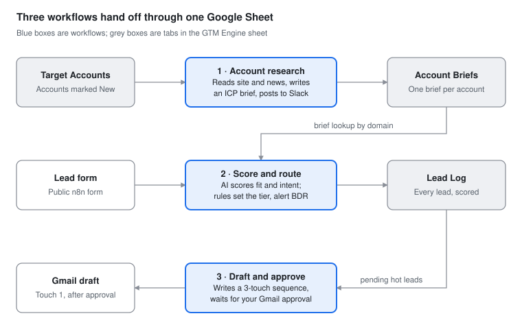

# AI-Powered GTM Engine

Three connected n8n workflows that research target accounts, score and route inbound leads, and draft outreach that a human approves before anything is sent. Built by Melissa Bradbury, a B2B SaaS demand generation and ABM leader, as a working portfolio of AI applied to go-to-market.

**[View the portfolio site](https://YOUR-USERNAME.github.io/ai-gtm-engine/)** · [LinkedIn](https://www.linkedin.com/in/melissabradbury/)

## The workflows

| # | Workflow | Business problem | Result |
| --- | --- | --- | --- |
| 1 | [ABM Account Research Agent](workflows/01-account-research/) | Reps spend 30–45 minutes (estimate) researching each target account before outreach | ~1 minute per evidence-based brief |
| 2 | [Inbound Lead Scoring and Routing](workflows/02-lead-scoring-routing/) | Hot leads wait in a queue while reps work cold ones | [[FILL: e.g. form to BDR alert in under 10 seconds]] |
| 3 | [Outreach Generator with Human Approval](workflows/03-outreach-approval/) | Generic outreach, or AI outreach nobody trusts to send | [[FILL: e.g. X of Y AI drafts approved without edits]] |

## How they connect

The workflows share one Google Sheet as their data layer. Workflow 1 writes account briefs. Workflow 2 checks every inbound lead against those briefs, flags target accounts, and promotes them in the queue. Workflow 3 picks up the hot leads, pulls the same brief, and drafts outreach grounded in it. Each piece works alone; together they behave like a small pipeline engine.

## Design principles

- **The model judges, the rules decide.** AI scores fit and intent; routing thresholds and overrides live in readable code that RevOps can audit and tune.
- **Evidence only.** Prompts restrict the model to the data it was given, label inferences, and report low confidence instead of inventing facts.
- **A human approves anything customer-facing.** Outreach becomes a draft only after a one-click approval, and every draft explains which details it used.
- **Structured output everywhere.** Fixed schemas and enums make every AI result sortable, countable and safe to route on.

## Built with

n8n · OpenAI gpt-5-mini · Google Sheets · Slack · Gmail

## Run it yourself

[SETUP.md](SETUP.md) covers credentials, the Google Sheet structure, the ICP definition the prompts use, and test data. 

The product being sold, Northwind Revenue Cloud, is fictional. Target accounts are real public companies so the research agent has real websites and news to read. All contacts in the test data are invented.
